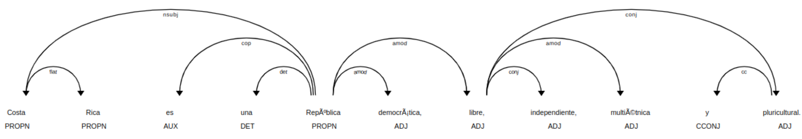

# Proyect Log
Notes about progress made (or not) as the proyect evolved.

**Table of Contents**
<!-- TOC -->
* [Proyect Log](#proyect-log)
  * [2025-05-15 Summary, so far](#2025-05-15-summary-so-far)
    * [Motivation](#motivation)
    * [Architecture](#architecture)
    * [Progress](#progress)
<!-- TOC -->

## 2025-05-15 Summary, so far

### Motivation
The motivation for the project, as described in the main 
README.md file, is to
> develop an efficient, 
escalable process to produce logic-based mechanisms to 
answer questions on Costa Rica legislation.

### Architecture
The initial plan, is to use an architecture mostly based 
on logic, while nevertheless use the power of public 
Large Language Models (LLMs) as part of the process to 
ingest and process data.

The overall architecture is this:
```text
Legal Texts (Costa Rica) 
   ↓
Text Extraction (pdfminer, spaCy)
   ↓
Syntactic Parsing (spaCy, CoreNLP)
   ↓
Information Extraction (Rules + Patterns)
   ↓
Logical Form Encoding (Prolog / ASP)
   ↓
Symbolic Reasoner (SWI-Prolog / Clingo)
   ↓
Answers to Questions (GUI or CLI)
```

### Progress
Ran initial trial tests, using `Flair` and 
`spaCy`.

`spaCy` seems to be more complete and produces different 
types of labels on the text, so we focused on it first.

When looking at the first experiments on 
`data/preprocessed/constitucion_sent_cr.txt`, using 
`src/legalogic/sandbox/entity_recog.py`, we found that 
the dependency parse trees often don't show a verb as 
its root node (which we expected to use as part of the 
predicate generation).  Here is an example:



Other items caught our attention, like the fact that 
"es", is 
classified as 
an "AUX" part-of-sentence (POS) and not a verb, despite 
using a Spanish 
language model for the analysis (`es_core_news_lg`).

As an alternative, we decided to look into using 
"Constituency-Based (Phrase Structure) Parse Trees" 
instead of Dependency-Based Parse Trees, as 
distinguished in [here](https://www.perplexity.ai/search/in-a-natural-language-parse-tr-gSlqZxCmTDig_8v4U.N.EQ).

A future challenge might be identifying related entities 
occurring in different sentences, though.

**Note**: Stanza has a [model for entity coreference](https://stanfordnlp.github.io/stanza/coref.html) for Spanish.

## 2025-04-15
Found two possible options to produce grammatical parsing:
- **spacy + benepar**
  - main repo for benepar is [here](https://github.com/nikitakit/self-attentive-parser)
  - per last version there is no model for 
    Spanish, among those listed [here](https://github.
    com/nikitakit/self-attentive-parser?tab=readme-ov-file#available-models).
  - as shown in `src/legalogic/sandbox/benepar.py`, we 
    didn't find a way to download this module.
- **Stanza**: to be tried next

## 2025-05-19
- **installed** `stanza`
- ensured **GPU** is available to `stanza`
- created **03-01_stanza_const_parse.py** as a first test 
  script on the constitución text.
- **Obtained expected** grammatical parse trees.

## 2025-05-19
Explored the structure of **dependency trees**
- created 03-02_stanza_dep_parse.py
- refered to [Perplexity](https://www.perplexity.ai/search/what-is-a-tame-category-in-the-058gKguZRsy3X93SukDE6Q) to understand dependency 
  relations (deprel)
- dependencies seem to actually be **a shortcut for 
  processing** the grammatical (constituency) parse tree, 
  once the [different types of dependencies](https://universaldependencies.org/u/dep/index.html) are well understood
- [learned about TAME](https://www.perplexity.ai/search/what-is-a-tame-category-in-the-058gKguZRsy3X93SukDE6Q) word categories

